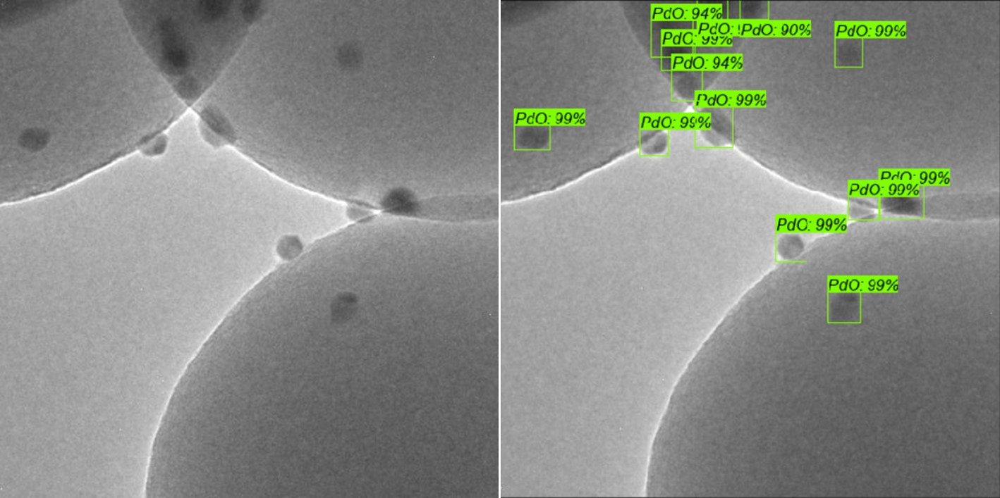
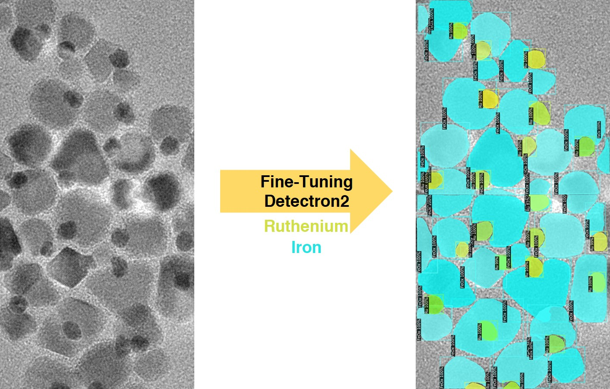
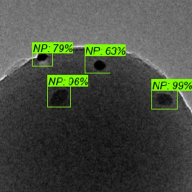

# Transmission Electron Microscopy and Machine Learning

A computational toolbox of computer vision tools for processing and analyzing electron micrographs for applications in material science. Applications include (1) image classification (what material is in this image?) (2) particle size analysis (what are the ensemble properties of my material?) and (3) elemental spatial mapping (image segmentation, assigning an element on the periodic table to each pixel in the image).

<p align="center">
  
</p>
<p align="center">
  
</p>

### Directory Setup

```
├── train
│   ├── Al2O3
│   ├── ...
│   └── TiO2
├── validation
│   ├── Al2O3
│   ├── ...
│   └── TiO2
```

### Image Preprocessing
Model training and fine-tuning done on dataset of electron microscopy images collected over 5 years and 12 students. For each material class (i.e. CeO2) a folder containing subfolders of each synthesized material is organized. All .dm3 files are pooled together and are converted simultaneously to .jpgs prevent unique conversion artifacts (i.e. different scalebar or contrast settings). Full images are screened 1-by-1 to make sure there are no similar images (which would be a problem if image appeared in both training and test data). Then, folder of .jpgs are split into quadrants using image_subcrops.py, and the original full-size images are discarded. From this dataset, every third image is selected and placed into a folder for test images (every third image was chosen to remove artificats from only choosing a specific quadrant). Finally, the validation data is quickly screened to remove poor images (i.e. empty field, only lacey C, or too high magnification.

### Prerequisites

* Python (version >= 3.5)
* Tensorflow (version 1.14)

### Documentation

* object_detection_NPs.ipynb - Perfected python notebook for testing your newly minted inference graphs
* create_GCPVM_forNCDetection - Setting up google cloud virtual machine from scratch for object detection
* order_images.py - Used to relabel the order of .jpg/.xml in a folder
* image_subcrops.py - Used to split a .jpg into subcrops of equal size (.jpg)

<!--
## Getting Started

These instructions will get you a copy of the project up and running on your local machine for development and testing purposes. See deployment for notes on how to deploy the project on a live system.


```
Give examples
```

### Installing

A step by step series of examples that tell you how to get a development env running

Say what the step will be

```
Give the example
```

And repeat

```
until finished
```

End with an example of getting some data out of the system or using it for a little demo

## Running the tests

Explain how to run the automated tests for this system

### Break down into end to end tests

Explain what these tests test and why

```
Give an example
```

### And coding style tests

Explain what these tests test and why

```
Give an example
```

## Deployment

Add additional notes about how to deploy this on a live system

## Built With

* [Dropwizard](http://www.dropwizard.io/1.0.2/docs/) - The web framework used
* [Maven](https://maven.apache.org/) - Dependency Management
* [ROME](https://rometools.github.io/rome/) - Used to generate RSS Feeds

## Contributing

Please read [CONTRIBUTING.md](https://gist.github.com/PurpleBooth/b24679402957c63ec426) for details on our code of conduct, and the process for submitting pull requests to us.

## Versioning

We use [SemVer](http://semver.org/) for versioning. For the versions available, see the [tags on this repository](https://github.com/your/project/tags). 

## Authors

* **Billie Thompson** - *Initial work* - [PurpleBooth](https://github.com/PurpleBooth)

See also the list of [contributors](https://github.com/your/project/contributors) who participated in this project.

## License

This project is licensed under the MIT License - see the [LICENSE.md](LICENSE.md) file for details

## Acknowledgments

* Hat tip to anyone whose code was used
* Inspiration
* etc
-->
