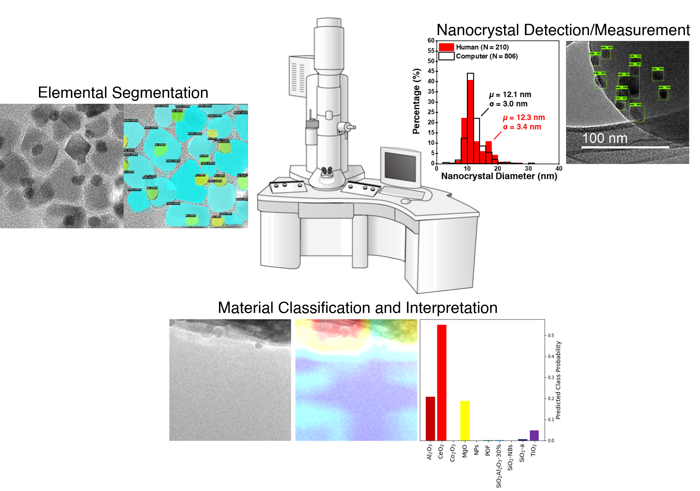

# Transmission Electron Microscopy and Machine Learning

A computational toolbox of computer vision tools for processing and analyzing electron micrographs for applications in material science. Applications include (1) material classification (what material is in this image?) (2) nanocrystal detection and particle size analysis (what are the ensemble properties of my material?) and (3) elemental spatial mapping (image segmentation, assigning an element on the periodic table to each pixel in the image).

<p align="center">
  
</p>

### Directory Setup

```
├── classification (distinguish between 10 metal oxides, with gradient class activation maps)
├── localization (localized PdO nanocrystal active sites and extract structural features)
├── segmentation (pixelwise labeling of Ru and Fe domains)
```

### Prerequisites

* Python (version >= 3.5)
* Tensorflow (version 1.14)
* PyTorch (version 1.5)
* Torchvision (version 0.5)

### Documentation
The following are generally helpful scripts for working with electron micrographs:
* order_images.py - Used to relabel the order of .jpg/.xml in a folder
* image_subcrops.py - Used to split a .jpg into subcrops of equal size (.jpg)

