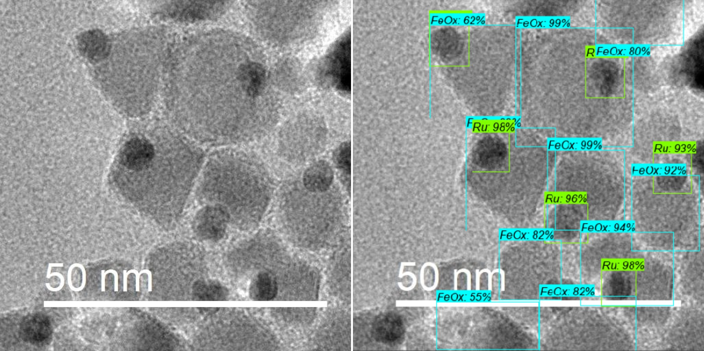

# Transmission Electron Microscopy and Machine Learning

Various projects involving electron microscopy and computer vision. First, we'll start with identification of nanocrystals in supported catalysts. Here, special effort is focused on low-contrast materials, such as PdO vs SiO2, and overlapping nanocrystals. Second, we'll learn to identify oxidation states of materials using only electron micrographs of the material. Object detection and classification was performed by fine-tuning ssd_inception_v2_coco object detection model on electron micrographs. 91% nanocrystal detection accuracy was achieved, with no false positives.

<p align="center">
  
</p>
<p align="center">
  
</p>

### Prerequisites

* Python (version >= 3.5)
* Tensorflow (version 1.14)

### Documentation

* object_detection_NPs.ipynb - Perfected python notebook for testing your newly minted inference graphs
* create_GCPVM_forNCDetection - Setting up google cloud virtual machine from scratch for object detection
* order_images.py - Used to relabel the order of .jpg/.xml in a folder
* quad_split - Used to split a .jpg into quadrant .jpg's

<!--
## Getting Started

These instructions will get you a copy of the project up and running on your local machine for development and testing purposes. See deployment for notes on how to deploy the project on a live system.


```
Give examples
```

### Installing

A step by step series of examples that tell you how to get a development env running

Say what the step will be

```
Give the example
```

And repeat

```
until finished
```

End with an example of getting some data out of the system or using it for a little demo

## Running the tests

Explain how to run the automated tests for this system

### Break down into end to end tests

Explain what these tests test and why

```
Give an example
```

### And coding style tests

Explain what these tests test and why

```
Give an example
```

## Deployment

Add additional notes about how to deploy this on a live system

## Built With

* [Dropwizard](http://www.dropwizard.io/1.0.2/docs/) - The web framework used
* [Maven](https://maven.apache.org/) - Dependency Management
* [ROME](https://rometools.github.io/rome/) - Used to generate RSS Feeds

## Contributing

Please read [CONTRIBUTING.md](https://gist.github.com/PurpleBooth/b24679402957c63ec426) for details on our code of conduct, and the process for submitting pull requests to us.

## Versioning

We use [SemVer](http://semver.org/) for versioning. For the versions available, see the [tags on this repository](https://github.com/your/project/tags). 

## Authors

* **Billie Thompson** - *Initial work* - [PurpleBooth](https://github.com/PurpleBooth)

See also the list of [contributors](https://github.com/your/project/contributors) who participated in this project.

## License

This project is licensed under the MIT License - see the [LICENSE.md](LICENSE.md) file for details

## Acknowledgments

* Hat tip to anyone whose code was used
* Inspiration
* etc
-->
