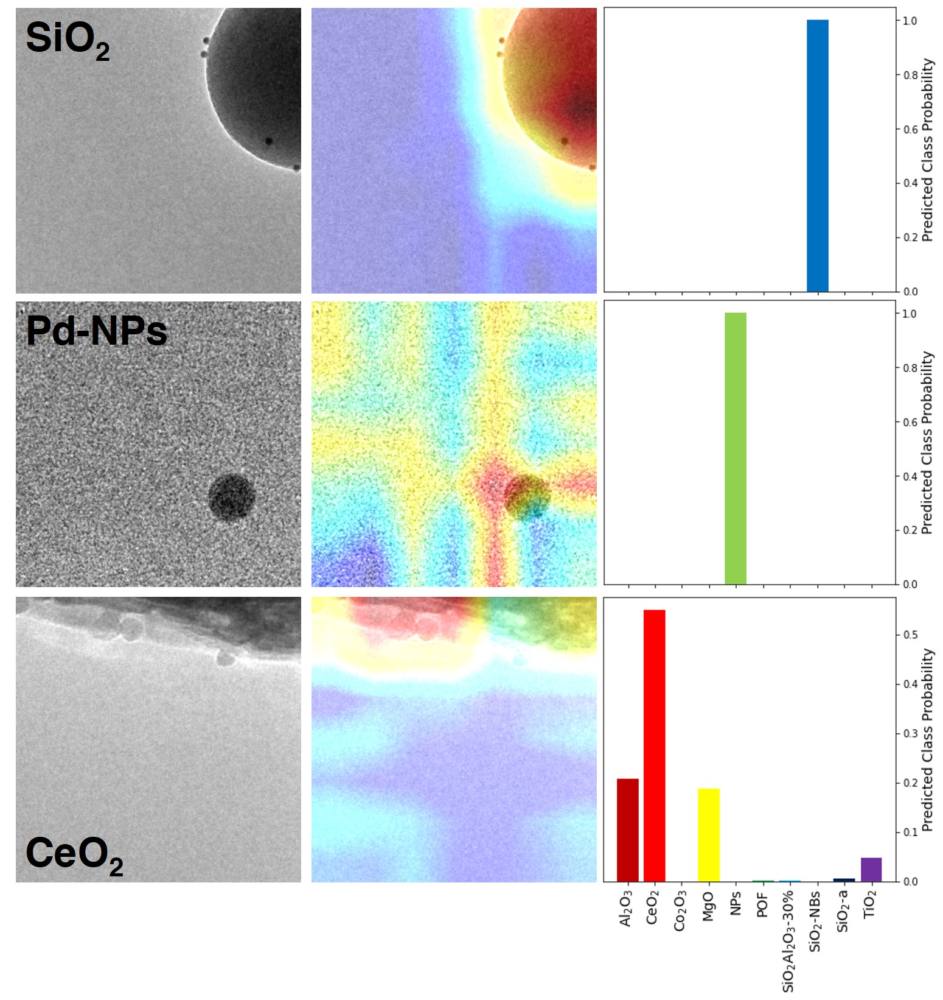

# Material Classification

This work studies the classification and interpretation of eight different materials based on their nanoscale images. The goal is to distinguish between various oxide nanomaterials and nanoparticle materials, composed of different elements or even the same element but different morphology.

<p align="center">
  
</p>

### Directory Setup

```
├── train
│   ├── Al2O3
│   ├── ...
│   └── TiO2
├── test
│   ├── Al2O3
│   ├── ...
│   └── ZrO2
├── val
│   ├── Al2O3
│   ├── ...
│   └── ZrO2
├── ten_class_weights (stored via callbacks)
├── 10supports_ClassActivationMapsCAMs.ipynb
├── SupportClassification_FineTuning_10Supports_Callbacks.ipynb
```

### Image Preprocessing
Model training and fine-tuning performed on a novel dataset of electron microscopy images collected over 5 years via 6 microscopists. For dataset compilation, for each material class (i.e. CeO2) a folder containing subfolders of each synthesized material is organized. All .dm3 files (native microscope format) were pooled together and were converted simultaneously to .jpgs using imageJ software to prevent unique conversion artifacts (i.e. different scalebar or contrast settings). Full images are screened 1-by-1 to make sure there are no similar images (which would be a problem if image appeared in both training and test data). Then, the folder of .jpgs were split into quadrants using image_subcrops.py, and the original full-size images were discarded. 

From this dataset, every third image was selected and placed into a folder for test images (every third image was chosen to remove artificats from only choosing a specific quadrant), and every sixth image was placed into a folder for val images. Finally, both the test and val data was quickly screened to remove poor images (i.e. empty field, only background C, or too high magnification.

### Prerequisites

* Python (version >= 3.5)
* Tensorflow (version 2.2.0)

### Documentation

* 8_supports_hyperparm_tuningloadedmodel.ipynb - python notebook for optimizing model hyperparameters
* model_validating_and_interpretability.ipynb - python notebook for testing and visualizing model performace
* data_augmentation_visualized.ipynb - python notebook for visualizing augmentations from image generator


