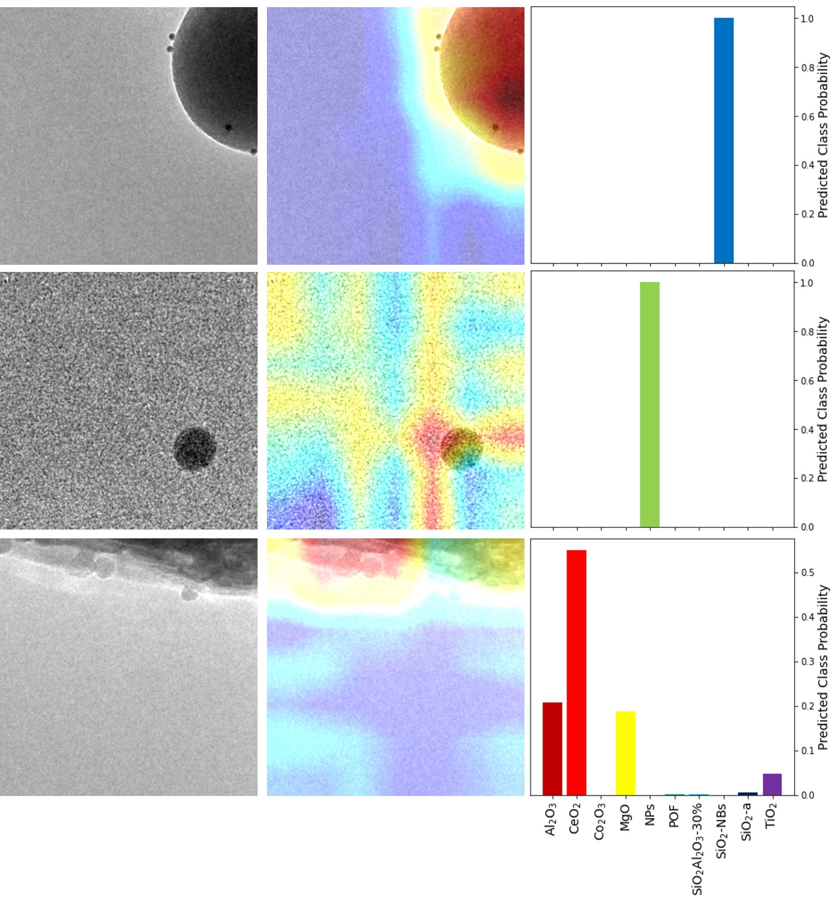

# Material Classification

This work studies the classification and interpretation of ten different materials based on their nanoscale images. The goal is to distinguish between various oxide nanomaterials, composed of different elements or even the same element but different morphology.

  

