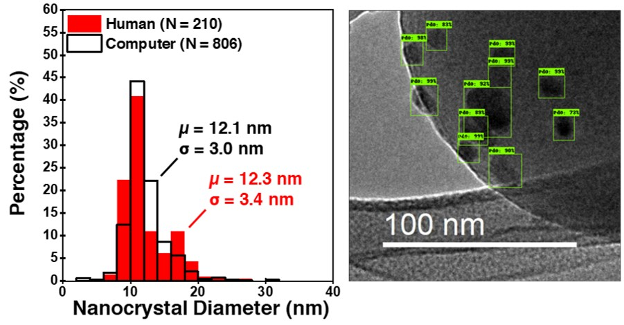

# Localization and Classification

This work localizes and classifies active sites for chemical reactions in transmission electron microscopy images. Our first goal is to automate particle size and facet analysis, which can be done slowly by humans already. Our best mean average precision of .951 (IoU=0.5) was achieved by fine-tuning a Faster-RCNN Inception Resnet V2 network on transmission electron microscopy images.

<p align="center">
  
</p>

### Directory Setup

The following is the directory setup for using colab notebook:
```
├── workingspace
│   ├── annotations (stores all .xml files)
│   ├── images
│       ├── train
│       ├── test
│   ├── faster_rcnn_inception_resnet_v2_atrous_coco_2018_01_28 (pretrained model)
│   ├── training_faster_rcnn (stores model checkpoints)
│       ├── faster_rcnn_inception_resnet_v2_atrous_coco.config (modified config file)
├── object_detection_scripts (generating .csv's and .record's)
│   ├── xml_to_csv.py
│   ├── generate_tfrecord.py
├── models
│   ├── research
│       ├── object_detection
```
### Prerequisites
* Python (version >= 3.5)
* Tensorflow (version 1.15.0)
* NumPy (version 1.17.4)
I have found the tensorflow object detection API to be quite sensitive to these versions

### Documentation

* PdO_detection_workbook_faster_rcnn_inception_resnet_v2_atrous_coco.ipynb - Comprehensive notebook including .csv and .record generation, GPU-training, and testing
* xml_to_csv.py - Python script to convert folder of .xml files to a .csv file
* generate_tfrecord.py - Python script to convert .csv file to .record file
* export_inference_graph.py - Export graph after model is finished training
