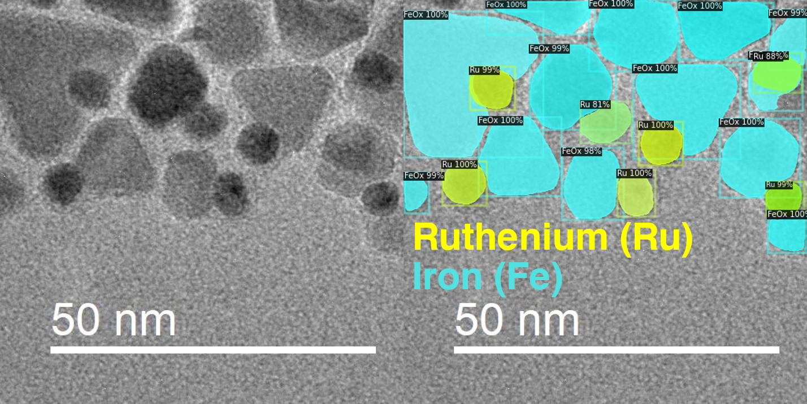

# Elemental Segmentation

This work aims to develop an algorithm to label each pixel in an electron micrograph with the corresponding element from the periodic table of elements. We use FAIR's newest object-detection and classification algorithms, based on Mask-RCNN.

<p align="center">
  
</p>

### Directory Setup

```
├── train_images
├── test_images
├── detectron2.ipynb
```
### Prerequisites
* Python (version >= 3.5)
* PyTorch (version 1.5)
* Torchvision (version 0.5)
### Documentation

* NP_Detectron2.ipynb - Comprehensive notebook including used for fine-tuning Mask_RCNN to nanoparticles. Here, we studied the impact of training set size, and found even a handful (1-4) images was enough to achieve effective segmentation
* image_segmentation_documentation.txt - Walkthrough, eventually will transcribe into readme
* labelme2coco.py - Take .json files from labelme and convert to coco file for the Colab notebook
